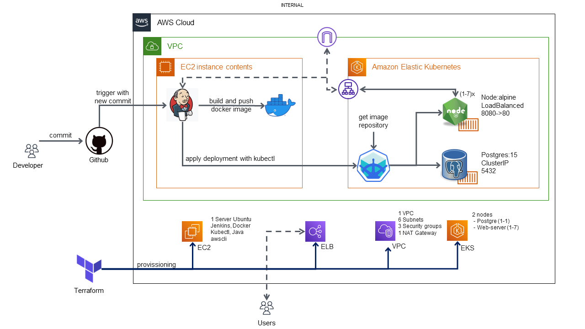
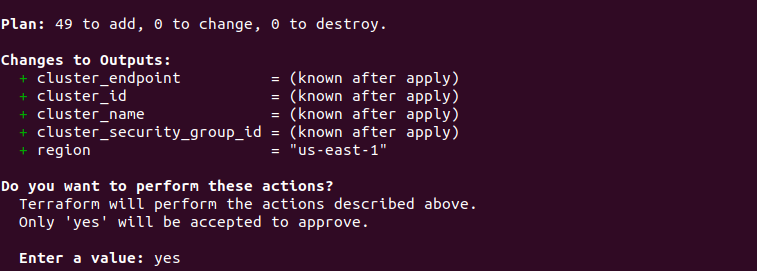
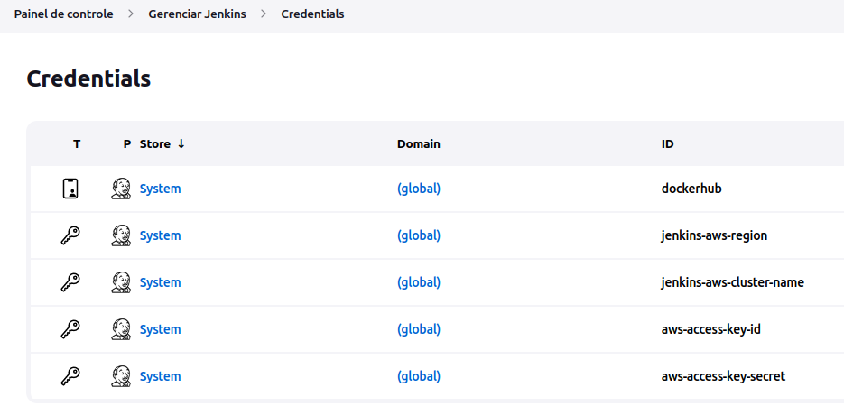
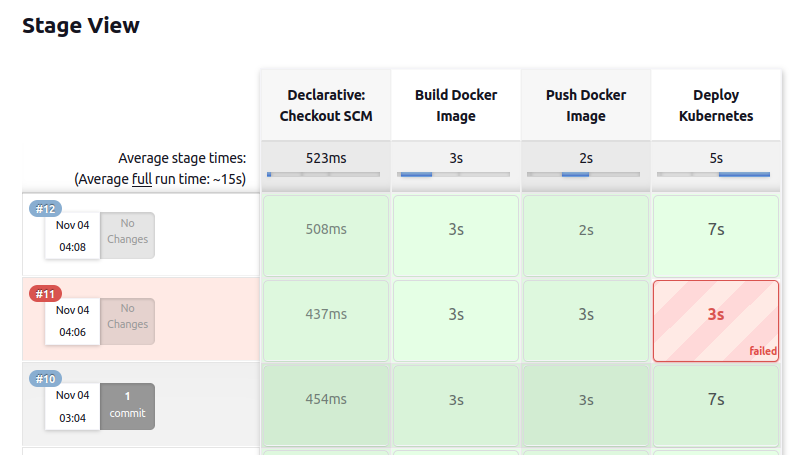
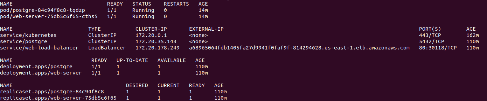
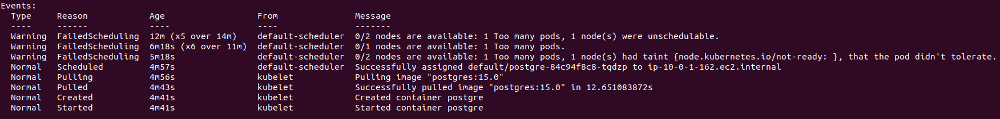
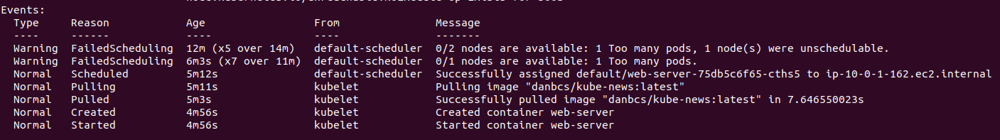
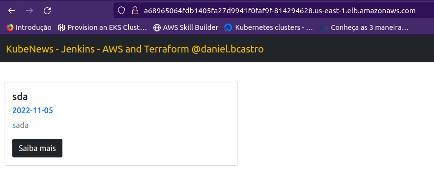

# Aplicação web com CI/CD AWS 
## Terraform · Jenkins · EKS AWS · K8S · Docker

<!---Esses são exemplos. Veja https://shields.io para outras pessoas ou para personalizar este conjunto de escudos. Você pode querer incluir dependências, status do projeto e informações de licença aqui--->

### Provissionamento e execução de aplicação na AWS com Terraform, EKS, integração e entrega contínua com Jenkins



> Esse repositório possui conceitos de docker, kubernetes, terraform, CICD com Jenkins e possui uma aplicação prática que pode ser provissionada na AWS, para auxiliar no entendimento e melhores práticas envolvendo esses processos.

### Ajustes e melhorias

Abaixo algumas melhorias que serão desenvolvidas nas próximas etapas:

- [x] Variavéis Jenkins
- [x] Versão EKS
- [x] Run full AWS
- [ ] Parametrizar credenciais de Usuário e Senha Postgres - Jenkinsfile
- [ ] Parametrizar nome da Imagem docker - Jenkinsfile
- [ ] Monitoramento

## 💻 Pré-requisitos

Todas as validações foram realizadas em  `Ubuntu 22.04`
Antes de começar, verifique se você atendeu aos seguintes requisitos:
* Possui `Terraform`, `Kubectl`, `Docker`, `aws cli`, `k3d` instalado;
* Seguir com a instalação conforme indicado nos sites oficiais;
* Conexão com a Internet.

## 🚀 Instalando Projeto localmente

Para instalar o projeto localmente, siga estas etapas.

Se tiver dificuldades, [veja esse repositorio](https://github.com/dbent0/conversor-temperatura-docker), detalhando uso de Docker e kubernetes localmente.

Após realizar o download/clonar, descompacte-o e execute `cd src`

Para gerar a imagem a partir do Dockerfile, executamos o comando abaixo no mesmo local que o arquivo se encontra:

Dica: seguir o padrão `usuario/nome_da_imagem:versão`
```
docker build -t nome_da_imagem .
```
Realizar a autenticação.
```
docker login
```
Após criar a imagem docker, pode realizar o pull para o seu Registry.
```
docker push nome_da_imagem
```

## ☕ Executando localmente
Inicialmente precisamos inicializar o container do postgres:
```
docker run --name meu-postgres -p5432:5432 -e POSTGRES_USER=kubenews -e POSTGRES_DB=kubenews -e POSTGRES_PASSWORD=pg#123 -d postgres:15.0
```
Se  as variáveis de acesso ao postgres forem modificadas será necessário configurar as seguintes variáveis de ambiente:
`DB_DATABASE` | `DB_USERNAME` | `DB_PASSWORD` | `DB_HOST`

Para criar o container a partir dessa imagem construída, podemos executar o comando:
```
docker container run -d -p 8090:8090 -e DB_USERNAME=kubenews -e DB_DATABASE=kubenews -e DB_PASSWORD=pg#123 -e DB_HOST=localhost nome_da_imagem
```
Assim teremos a aplicação executando no endereço:
```
localhost:8090
```
Mas, se necessário escalar essa aplicação ou atualizar o conteiner já começa a dor de cabeça 😢, como se deve gerenciar esses containers em caso de falha? atualizações? melhorias?

Para isso utilizamos o kubernetes(k8s) para orquestrar os containers visando a escalabilidade e redução de downtime devido a manutenções ou melhorias.

Criar clusterorquestrador com K3D:
```
k3d cluster create -p 80:30000 cluster-temp
```
Rodar deployment k8s:

Localizar pasta k8s `cd ../k8s/`

Dica: necessário ajustar a imagem no arquivo deployment-local.yaml

Após ajuste, executar
```
kubectl apply -f deployment-local.yaml
```
Acessar aplicação por:
```
localhost:80
```
Listar os pods e serviços:
```
kubectl get all
```
## 🚀 Iniciando Projeto na AWS
Configurar awscli com sua conta.
#### Terraform
Na pasta terraform, executar
```
terraform init
```
Após baixar as dependencias, executar
```
terraform apply
```
Confirmar a execução digitando `yes`



#### Jenkins
Acessar servidor EC2 (Ubuntu 22.04) que foi criado, instalar os seguintes pacotes
 - `Java JDK`
 - `Jenkins`
 - `Docker`
 - `Kubectl`
 - `awscli`

Executar o comando abaixo para executar o docker sem necessidade de sudo.
```
usermod -aG docker jenkins
```
Reiniciar Jenkins
```
systemctl restart jenkins
```

Criar pipeline no jenkins e apontar para repositório clonado, buscando o arquivo Jenkinsfile.

Criar as variáveis de ambiente de forma segura, por meio de criptografia.


## ☕ Executando AWS

Após o provissionamento e configuração do Jenkins, será necessário rodar a pipeline, por meio da aplicação ou executar commit no github.

Dica: Para integração com github, necessário habilitar o webhook no projeto.

O resultado será o seguinte:


Localmente, para configurar o kubectl para apontar ao cluster na AWS, execute 
```
aws eks --region $(terraform output -raw region) update-kubeconfig \
    --name $(terraform output -raw cluster_name)
```
Agora, executar o comando abaixo para ver status do cluster, pods e services.
```
kubectl get all
```
Log do Jenkins, [link.](jenkins.log)

Acesse a aplicação por meio do endpoint do LoadBalancer.


#### POD - Postgres
Comando `kubectl describe pod postgre` para identificar logs de execução.


#### POD - web-server
Comando `kubectl describe pod web-server` para identificar logs de execução.


Aplicação em execução.

## 📫 Contribuindo para cicd-devops-code
<!---Se o seu README for longo ou se você tiver algum processo ou etapas específicas que deseja que os contribuidores sigam, considere a criação de um arquivo CONTRIBUTING.md separado--->
Para contribuir com cicd-devops-code, siga estas etapas:

1. Bifurque este repositório.
2. Crie um branch: `git checkout -b <nome_branch>`.
3. Faça suas alterações e confirme-as: `git commit -m '<mensagem_commit>'`
4. Envie para o branch original: `git push origin <nome_do_projeto> / <local>`
5. Crie a solicitação de pull.

Como alternativa, consulte a documentação do GitHub em [como criar uma solicitação pull](https://help.github.com/en/github/collaborating-with-issues-and-pull-requests/creating-a-pull-request).
